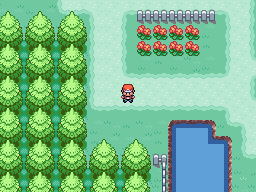
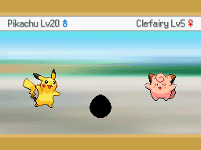

# Single Screen Day-Care Checker Item
This script is for Pokémon Essentials. It makes a single screen Day-Care Checker (like in DPP Pokétch) activated by item. This displays the pokémon sprites, names, levels, genders and if they generated an egg.

## Screens

## Installation
Follow the [Script](/Script.rb) instructions. The sample script files are in [Files folder](/Files).